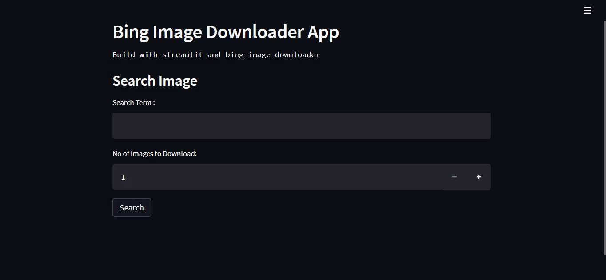

## bing image downloader app


- bing image downloader app is used to download bulk images for a specific search term.
- bing image downloader app gets the search term and limit count from user using streamlit's `text_input` and `number_input` to download images.
- If user clicks the Search button and search term is empty then the app displays a warning message to the user
- If user clicks the Search button and search term is not empty then the app search and download images to a folder.
- Then call `zipfile()` function to compress the folder to a zip file for download.
- Finally, When the user click the download button zip file is downloaded to their local machine.

### Installation
To install all necessary requirement packages for the app 👇
```
pip install -r requirements.txt
```

### Downloader Function
```python
# Search for the images, Download it and store it in a folder named same as the search term
downloader.download(query=search_text, limit=limit_number, output_dir=search_text,
                    adult_filter_off=True, force_replace=False, timeout=60, verbose=True)
```

- `query_string` : String to be searched.
- `limit` : Number of images to download.
- `output_dir` : Name of output directory.
- `adult_filter_off` : Enable of disable adult filteration.
- `force_replace` : Delete folder if present and start a fresh download.
- `timeout` : Timeout for connection in seconds.
- `verbose` : Enable downloaded message in command prompt.

#### If the Search term is empty: 

#### If the Search term is not empty: 

